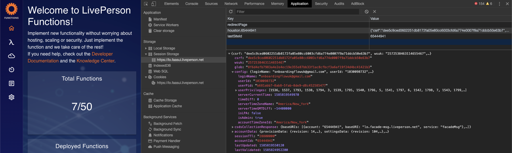

<!-- omit in toc -->
# LivePerson Functions CLI

- [Installation](#installation)
  - [Npm](#npm)
- [Commands](#commands)
  - [Help](#help)
  - [Autocomplete](#autocomplete)
  - [Version and Update](#version-and-update)
  - [Init](#init)
  - [Login](#login)
    - [SSO-Support](#sso-support)
  - [Logout](#logout)
  - [Deploy](#deploy)
  - [Undeploy](#undeploy)
  - [Pull](#pull)
  - [Push](#push)
  - [Invoke](#invoke)
  - [Debug](#debug)
  - [Get](#get)
- [Local development and debugging](#local-development-and-debugging)
  - [Introduction](#introduction)
  - [Preparation](#preparation)
  - [Debugging with VSC](#debugging-with-vsc)
  - [Debugging with Intellij](#debugging-with-intellij)
  - [Debugging with other IDEs or Debugger](#debugging-with-other-ides-or-debugger)

## Installation

Before you start using lpf, you have to make it available on your computer. Even if it's already installed, it's probably a good idea to update to the latest version. You can either install it as a package, via another installer or download the source code.

### Npm

```
> npm install -g faas-cli
```

> Please make sure you have all user rights on your computer or run the commands with sudo or the cmd as admin, otherwise some operations will fail due to missing rights

## Commands

<table style="width: 100%;">
<thead>
  <tr>
    <th style="width: 100px;" >Command</th>
    <th style="width: 276px;">Description</th>
  </tr>
</thead>
<tbody>
  <tr>
    <td>Help</td>
    <td>Shows help for the cli and the supported commands.</td>
  </tr>
  <tr>
    <td>Autocomplete</td>
    <td>Displays autocomplete instructions (only supports zsh and bash).</td>
  </tr>
  <tr>
    <td>Version</td>
    <td>Shows the current installed version.</td>
  </tr>
  <tr>
    <td>Init</td>
    <td>Initialize the project with the necessary files. If the project is already initialised it will add a new function.</td>
  </tr>
  <tr>
    <td>Login</td>
    <td>Performs the login with LiveEngage Credentials.</td>
  </tr>
  <tr>
    <td>Logout</td>
    <td>Performs the logout.</td>
  </tr>
  <tr>
    <td>Deploy</td>
    <td>Deploys a function on the LivePerson functions platform. If the passed function is already deployed, it will be redeployed.</td>
  </tr>
  <tr>
    <td>Undeploy</td>
    <td>Undeploys a function on the LivePerson functions platform.</td>
  </tr>
  <tr>
    <td>Pull</td>
    <td>Pulls a function from the LivePerson functions platform.</td>
  </tr>
  <tr>
    <td>Push</td>
    <td>Pushes a function to the LivePerson functions platform.</td>
  </tr>
  <tr>
    <td>Invoke</td>
    <td>Invokes a function (remote or local).</td>
  </tr>
  <tr>
    <td>Debug</td>
    <td>Starts a debug port in the range of 30500 - 31000 for a passed function.</td>
  </tr>
  <tr>
    <td>Get</td>
    <td>Get information about the passed domain. Possible domains are deployments, functions and account.</td>
  </tr>
</tbody>
</table>

### Help

If you ever need help while using lpf, there are three equivalent ways to get the comprehensive manual page (manpage) help for any of the lpf commands:
```
> lpf help

> lpf help <command>

> lpf <command> --help -h
```

For example, you can get the manpage help for the lpf login command by running

```
> lpf help login
```

### Autocomplete

Displays autocomplete instructions (only supports zsh and bash)

<details>
<summary>Usage</summary>

```
> lpf autocomplete [--flag]
```
</details>

<details>
<summary>Options</summary>

| Flag         | Description                                     |
| ------------ | ----------------------------------------------- |
| -h --help    | Show help for the login command                 |
| -r --refresh | Refresh cache (ignores displaying instructions) |
</details>

<details>
<summary>Example</summary>

```
> lpf autocomplete

> lpf autocomplete bash

> lpf autocomplete zsh

> lpf autocomplete --refresh-cache
```
</details>

### Version and Update

The version command shows the current installed version of the CLI. 
If a newer version is available the user will see an update information which shows his current version, the new version and a information about how to update to the new version.

The update notification will appear one time and then it's muted for two days.

<details>
<summary>Example</summary>

```
> lpf version

> lpf -v

> lpf --version
```
</details>


### Init

Initialize the project with the necessary files. If the project is already initialised it will add a new function with the passed functionname. 

The folder name has to be same as the function name (saved in the config.json).

Follwoing files will be created: 

* README: Contains information about the usage of the CLI
* .gitignore: Specifies intentionally untracked files to ignore ([Link](https://git-scm.com/docs/gitignore))
* .vscode: VS code settings and tasks for the local debugger (do not change these files!)
* bin: Local toolbelt, rewire requirements and debugger (do not change these files!)
* functions: Contains the different functions folder
* settings: Contains the secrets and whitelisting.
* functions folder:
  * index.js: Contains the function
  * config.json: Contains the function name and event and the related input and environment variables.

<details>
<summary>Folder structure</summary>

```
README.md
.gitignore
.vscode/
  ├── launch.json
  └── task.json
bin/
  ├── lp-faas-toolbelt/
      ├── //Toolbelt functions
      └── package.json
  ├── rewire.js
  └── faas-debugger.js
functions/
    settings.json
    exampleFunction/
        ├── index.js
        └── config.json
    customFunction/
        ├── index.js
        └── config.json
```
</details>

<details>
<summary>Usage </summary>

```
> lpf init [parameter]
```
</details>

<details>
<summary>Options </summary>

| Parameter    | Description                                              |
| ------------ | -------------------------------------------------------- |
| functionname | Adds a function with the passed name (multiple possible) |

| Flag      | Description                    |
| --------- | ------------------------------ |
| -h --help | Show help for the init command |
</details>

<details>
<summary>Example</summary>

```
> lpf init <functionname>

> lpf init <functionname> <functionsname>
```
</details>

### Login

Performs the login with LiveEngage Credentials. 

After a successful login, it is valid for 8 hours. After this period of time a new login has to be performed. It is also possible to have multiple logins saved, but only one at a time is active.

The command will create a temp file with the credentials in the `node temp dir` (see [doc](https://nodejs.org/api/os.html#os_os_tmpdir)). The file is encrypted with aes256.

To switch between accounts just run the login command again and select your desired account. If the login is not valid anymore for this account you have to pass again the credentials.

If you want to add a new account just run the login command and select `other`.

<details>
<summary>Usage</summary>

```
> lpf login [--flag]
```
</details>

<details>
<summary>Options</summary>

| Flag           | Description                     |
| -------------- | ------------------------------- |
| -h --help      | Show help for the login command |
| -a --accountId | AccountId                       |
| -u --username  | Username                        |
| -p --password  | Password                        |
</details>

<details>
<summary>Example</summary>

```
> lpf login

> lpf login --accountId 123456789 --username user@liveperson.com --password p4ssw0rd
 
> lpf login -a 123456789 -u user@liveperson.com -p p4ssw0rd
```
</details>

#### SSO-Support

Currently the CLI login is restricted to the [user login](https://developers.liveperson.com/login-service-api-methods-user-login.html). To use the login with an SSO enabled account you have to fetch the token and userId from the FaaS UI.

> It is advisable to create a separate account for the CLI, because with each new login on a different page the token expires in the CLI (only one login per account is possible).

To get the token and the userId do following steps:

1. Open the FaaS UI and login.
2. Open the developer tools of your browser.
3. Go to the tab 'Application'.
4. Open the session storage with the key 'houston.<accountId>'.
5. Copy token and userId.
   - Token: 'glob'
   - UserId: 'config.userId'
 

6. Run the login command as follows: `lpf login --token <bearer> --accountId <accountId> --userId <userId>`

> Note: If you get a message that the token is not valid anymore, you have to perform step 1 - 6 again.

### Logout

Performs the logout

After a successful logout the token for the selected account will be set to `null`. You can pass an accountId as flag, so no selection will be triggered.

Futhermore it's possible to provide a delete flag, then the account will be deleted from the temp file.

<details>
<summary>Usage</summary>

```
> lpf logout [--flag]
```
</details>

<details>
<summary>Options</summary>

| Flag           | Description                                            |
| -------------- | ------------------------------------------------------ |
| -h --help      | Show help for the login command                        |
| -a --accountId | Account which will be logged out                       |
| -d --delete    | Deletes the account credentials from the local machine |
</details>

<details>
<summary>Example</summary>

```
> lpf logout

> lpf logout --accountId 123456789

> lpf logout --accountId 123456789 --delete
 
> lpf logout -a 123456789 -d
```
</details>

### Deploy

Deploys a function on the LivePerson functions platform (function has to exist on the platform). If the passed function is already deployed, it will be redeployed.

The command can be run from the root directory or functions folder, then it's necessary to pass a functionname. If the user runs the command inside a functions folder, it's not necessary and the command will take the function of the current directory.

<details>
<summary>Usage</summary>

```
> lpf deploy [parameter] [--flag]
```
</details>

<details>
<summary>Options</summary>

| Parameter    | Description                                          |
| ------------ | ---------------------------------------------------- |
| functionname | Pass the function for deployment (mulitple possible) |

| Flag          | Description                                                                   |
| ------------- | ----------------------------------------------------------------------------- |
| -h --help     | Show help for the deploy command                                              |
| -y --yes      | Agrees to the approval of the deployment and prevents the confirmation dialog |
| -w --no-watch | Hide informations about the deployment process                                |
</details>

<details>
<summary>Example</summary>

```
> lpf deploy exampleFunction

> lpf deploy exampleFunction --yes --no-watch

> lpf deploy exampleFunction1 exampleFunction2 -y -w
```
</details>

### Undeploy

Undeploys a function on the LivePerson functions platform (function has to exist on the platform).

The command can be run from the root directory or functions folder, then it's necessary to pass a functionname. If the user runs the command inside a functions folder, it's not necessary and the command will take the function of the current directory.


<details>
<summary>Usage</summary>

```
> lpf undeploy [parameter] [--flag]
```
</details>

<details>
<summary>Options</summary>

| Parameter    | Description                                            |
| ------------ | ------------------------------------------------------ |
| functionname | Pass the function for undeployment (mulitple possible) |

| Flag          | Description                                                                     |
| ------------- | ------------------------------------------------------------------------------- |
| -h --help     | Show help for the deploy command                                                |
| -y --yes      | Agrees to the approval of the undeployment and prevents the confirmation dialog |
| -w --no-watch | Hide informations about the undeployment process                                |
</details>

<details>
<summary>Example</summary>

```
> lpf undeploy exampleFunction

> lpf undeploy exampleFunction --yes --no-watch

> lpf undeploy exampleFunction1 exampleFunction2 -y -w
```
</details>

### Pull

Pulls a function from the LivePerson functions platform (function has to exist on the platform).

You will be asked, if you want to overwrite your local state with the one from the platfrom.

The confirmation can be skipped by passing the --yes flag.

You can pass the --all flag, if you want to pull all functions from the platform.

<details>
<summary>Usage</summary>

```
> lpf pull [parameter] [--flag]
```
</details>

<details>
<summary>Options</summary>

| Parameter    | Description                                    |
| ------------ | ---------------------------------------------- |
| functionname | Pass the function for pull (mulitple possible) |

| Flag          | Description                                                             |
| ------------- | ----------------------------------------------------------------------- |
| -h --help     | Show help for the pull command                                          |
| -y --yes      | Agrees to the approval of the pull and prevents the confirmation dialog |
| -w --no-watch | Hide informations about the pull process                                |
| -a --all      | Pulls all functions from the platform                                   |
</details>

<details>
<summary>Example</summary>

```
> lpf pull exampleFunction

> lpf pull exampleFunction --yes --no-watch

> lpf pull exampleFunction1 exampleFunction2 -y -w
```
</details>

### Push

Pushes a function to the LivePerson functions platform.

You will be asked, if you want to overwrite your remote state with the one from your local machine.

The confirmation can be skipped by passing the --yes flag.

If it's a new function, which is not created on the platform, the CLI will create this one.

You can pass the --all flag, if you want to push all local functions to the platform.

<details>
<summary>Usage</summary>

```
> lpf push [parameter] [--flag]
```
</details>

<details>
<summary>Options</summary>

| Parameter    | Description                                    |
| ------------ | ---------------------------------------------- |
| functionname | Pass the function for push (mulitple possible) |

| Flag          | Description                                                             |
| ------------- | ----------------------------------------------------------------------- |
| -h --help     | Show help for the push command                                          |
| -y --yes      | Agrees to the approval of the push and prevents the confirmation dialog |
| -w --no-watch | Hide informations about the push process                                |
| -a --all      | Pushes all local functions                                              |
</details>


<details>
<summary>Example</summary>

```
> lpf push exampleFunction

> lpf push exampleFunction --yes --no-watch

> lpf push exampleFunction1 exampleFunction2 -y -w
```
</details>

### Invoke

Invokes a function (remote or local).

If you pass the --local flag the function will be invoked locally. Otherwise it will be invoked on the functions platform.

For both cases it will use the input from the related function config.json.

> The local invocation uses the mocked `faas-toolbelt` so please have a look at [Preparation](#preparation) for further informations.

<details>
<summary>Usage</summary>

```
> lpf invoke [parameter] [--flag]
```
</details>

<details>
<summary>Options</summary>

| Parameter    | Description                 |
| ------------ | --------------------------- |
| functionname | Pass the function to invoke |

| Flag       | Description                               |
| ---------- | ----------------------------------------- |
| -h --help  | Show help for the invoke command          |
| -l --local | Invokes the function on the local machine |
</details>

<details>
<summary>Example</summary>

```
> lpf invoke exampleFunction

> lpf invoke exampleFunction --local

> lpf invoke exampleFunction1 -l
```
</details>

### Debug

Starts a debug port in the range of 30500 - 31000 for a passed function.

<details>
<summary>Usage</summary>

```
> lpf debug [parameter] [--flag]
```
</details>

<details>
<summary>Options</summary>

| Parameter    | Description                |
| ------------ | -------------------------- |
| functionname | Pass the function to debug |

| Flag      | Description                     |
| --------- | ------------------------------- |
| -h --help | Show help for the debug command |
</details>

<details>
<summary>Example</summary>

```
> lpf debug exampleFunction
```
</details>                                                

### Get

Get information about the passed domain. Possible domains are deployments, functions and account. 

The following informations will be displayed:

* Deployment: Name, Undeployed changes from, Last successful deployment, deployed by, deployment state
* Function: Name, Status, last changed at, last changed by, Event
* Account: Offers insights that are currently generated by the welcome page

<details>
<summary>Usage</summary>

```
> lpf get [paramter] [--flag]
```
</details>

<details>
<summary>Options</summary>

| Parameter | Description                             |
| --------- | --------------------------------------- |
| domain    | Pass a valid domain (mulitple possible) |

| Flag      | Description                   |
| --------- | ----------------------------- |
| -h --help | Show help for the get command |
</details>

<details>
<summary>Example</summary>

```
> lpf get account

> lpf get functions deployments 

> lpf get functions deployments account
```
</details>

## Local development and debugging

### Introduction

The CLI provides a way to debug and develop functions locally.

For the best developer experience it's recommended to use [Visual Studio Code](https://code.visualstudio.com/) (VSC) or [Intellij](https://www.jetbrains.com/idea/), because a configuration for the integrated debugger is provided by the CLI.

During the debugging process all console outputs will be printed to your terminal. At the end a history with all printed console outputs will be displayed.

### Preparation

It's necessary to run the `lpf init` command to initialize the project structure and to install all required packages for the local faas-toolbelt. 

To get started with the local development and debugging some preparation is needed:
* Local secrets and whitelisting can be stored in the settings.json
* Local environment variables and input can be stored in the config.json in the functions folder
* The Debugger will use a mocked `faas-toolbelt`
* To have access to the LivePerson services it's necessary to be logged in or set an environment variable called `BRAND_ID` with your `accountId` 
  * Example with BRAND_ID and debug command: `BRAND_ID=123456789 lpf debug TestFunction`


### Debugging with VSC

1. Set a breakpoint in your desired function.
2. Run the debugger (two options available)
   1. `lpf debug <functionname>`
   2. Open command palette -> `Tasks: Run Task` -> `Debug Function`
3. Run `Attach FaaS Debugger` from the `launch.json`.
4. The debugger will start and pause at the auto-generated code.
5. Use Intellij debugger to navigate through your code.

### Debugging with Intellij

1. Set a breakpoint in your desired function.
2. Run the debugger (two options available)
   1. Use the built-in bar at the right top corner or
   2. Click on `Run` -> `Run...` 
3. Select `Start FaaS Debugger` and run the command.
4. Select `Attach FaaS Debugger` and run the command.
5. The debugger will start and pause at the auto-generated code.
6. Use Intellij debugger to navigate through your code.

### Debugging with other IDEs or Debugger

1. Set a breakpoint in your desired function.
2. Run the debugger (two options available)
   1. Run `lpf debug <functionname>` or
   2. Run `node ../bin/debug.js <functionname>`
3. A debug port will start on the port 1337
4. Attach your favorite IDE or debugger to this port
5. Use the debugger to navigate through your code.
